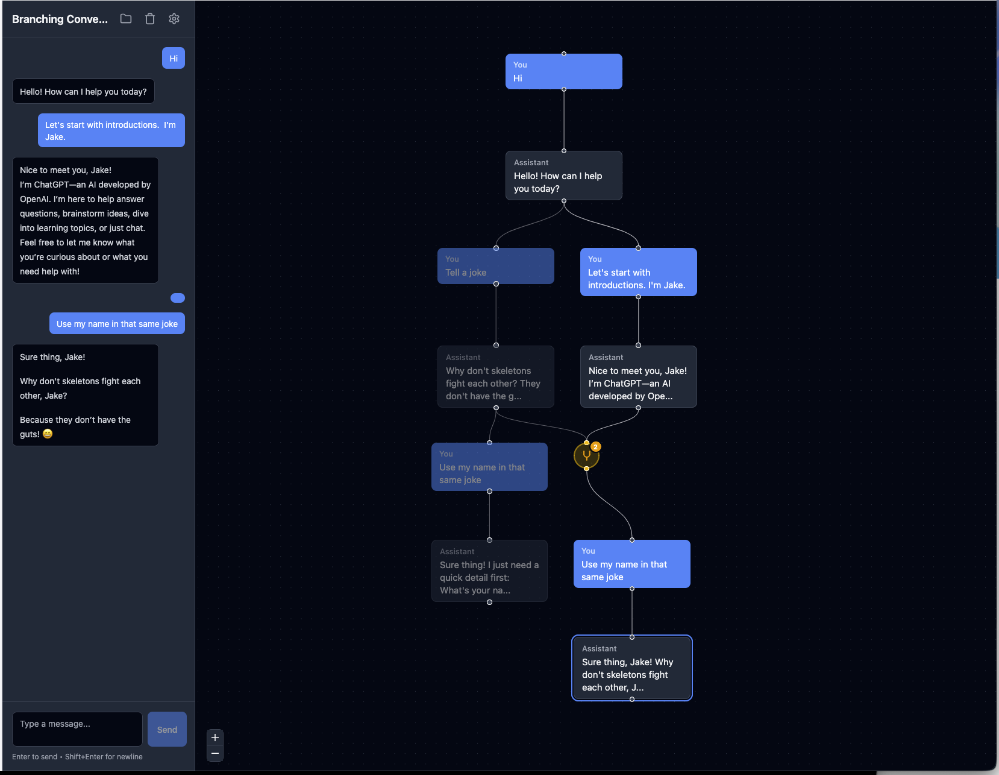

# Node Map LLM UI

A visual conversation tree interface for interacting with Large Language Models. This application displays LLM conversations as an interactive node graph, enabling branching conversations and merging multiple conversation paths.



## Features

- **Visual Conversation Tree**: See your entire conversation history as an interactive directed acyclic graph (DAG)
- **Branching Conversations**: Create alternative responses by branching from any point in the conversation
- **Merge Nodes**: Combine multiple conversation branches into a single context for the LLM
- **Multiple Chat Management**: Create, switch between, and delete separate conversation sessions
- **Streaming Responses**: Real-time streaming of LLM responses with abort capability
- **Auto-generated Summaries**: Branch summaries generated by the LLM for quick context
- **Resizable Sidebar**: Adjustable chat panel width with persistence
- **Dark Theme**: Modern dark UI optimized for extended use

## Tech Stack

- **React 18** - UI framework
- **TypeScript** - Type safety
- **Vite** - Build tool and dev server
- **Zustand** - State management with persistence
- **React Flow (@xyflow/react)** - Interactive node graph visualization
- **Dagre** - Automatic graph layout
- **Tailwind CSS v4** - Styling
- **React Markdown** - Message rendering with GFM support

## Requirements

- Node.js 18+
- npm or yarn
- Desktop browser (minimum 1024px viewport width)
- OpenAI-compatible API endpoint

## Installation

```bash
# Clone the repository
git clone <repository-url>
cd node-map-llm-ui

# Install dependencies
npm install

# Start development server
npm run dev
```

## Configuration

On first launch, click the settings icon to configure your LLM connection:

1. **API Endpoint**: Your OpenAI-compatible API URL (e.g., `https://api.openai.com/v1`)
2. **API Key**: Your API key for authentication
3. **Model**: Select from available models or enter a custom model name

The application supports any OpenAI-compatible API including:
- OpenAI
- Ollama (local)
- LM Studio (local)
- Azure OpenAI
- Other compatible providers

## Usage

### Basic Conversation
1. Type a message in the input field at the bottom of the sidebar
2. Press Enter or click Send to submit
3. The conversation appears as nodes in the canvas view

### Branching
- Click any node in the conversation tree to navigate to that point
- Send a new message to create a branch from the selected node
- Multiple branches can exist from any single node

### Merging Branches
1. Hold Shift and click nodes to select multiple conversation endpoints
2. Click the "Merge" button that appears
3. The LLM receives context from all selected branches combined
4. A merge node is created showing the consolidated conversation

### Navigation
- **Pan**: Click and drag on the canvas
- **Zoom**: Mouse wheel or pinch gesture
- **Select Node**: Click a node to navigate to that point in the conversation
- **Fit View**: Double-click empty canvas area

## Project Structure

```
src/
├── components/
│   ├── Canvas/          # React Flow canvas view
│   ├── ChatSidebar/     # Chat interface and message display
│   ├── Chats/           # Multi-chat management modal
│   └── Settings/        # Configuration modal
├── edges/               # Custom React Flow edge types
├── nodes/               # Custom React Flow node types
├── services/            # LLM API integration
├── store/               # Zustand state management
├── types/               # TypeScript type definitions
└── utils/               # Layout and helper utilities
```

## Scripts

```bash
npm run dev      # Start development server
npm run build    # Build for production
npm run preview  # Preview production build
npm run lint     # Run ESLint
```

## Docker

Build and run with Docker:

```bash
# Build the image
docker build -t node-map-llm-ui .

# Run the container
docker run -p 3000:3000 node-map-llm-ui
```

The application will be available at `http://localhost:3000`.

## License

MIT
